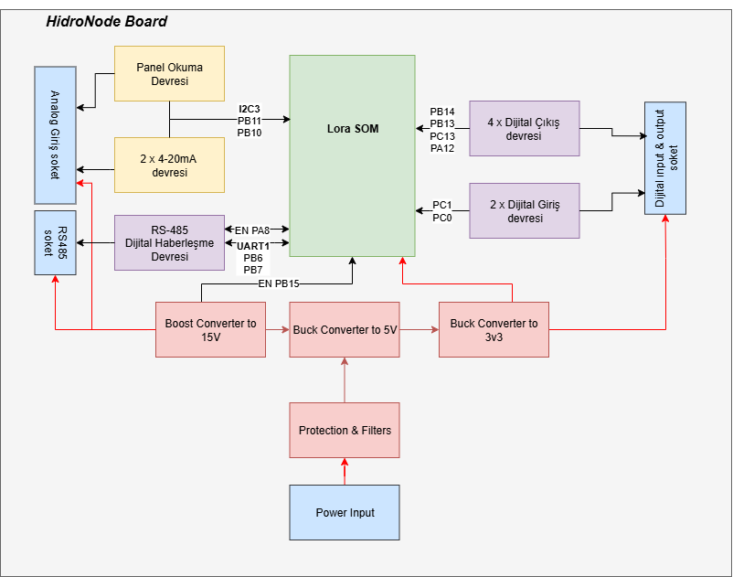

# STM32WL HidroNode – Donanım Tasarım Dokümantasyonu

> **Hazırlayan:** Oğuzhan ESEN  
> **Proje Adı:** HidroNode Board 
> **Tarih:** 24 Eylül 2025  
> **Versiyon:** v1.0
---

## İçindekiler

1. [Giriş](#1-giriş)  
2. [Tasarımın Amacı ve Kapsamı](#2-tasarımın-amacı-ve-kapsamı)  
3. [Sistem Blok Diyagramı](#3-sistem-blok-diyagramı)  
4. [Tasarım Özeti](#4-tasarım-özeti)  
5. [Şematik ve PCB](#5-şematik-ve-pcb)  
6. [Test Notları](#6-test-notları)  
7. [Geliştirme ve İyileştirme Önerileri](#7-geliştirme-ve-iyileştirme-önerileri)
---

## 1. Giriş

Bu doküman, LoraSOM Kartının taşıyıcısını  olan HidroNode kartını açıklamayı amaçlamaktadır. 
Tasarım, aşağıdaki isterleri karşılamak üzere gerçekleştirilmiştir:

- LoraSOM kartı ile pin uyumu sağlanması.
- Sensörlerle Dijital haberleşme yapabilmesi için **(TPEC)** RS485 engtegresinin bulunması.
- Sensörlerle Analog haberleşme yapabilmesi için **(Radar)** 4-20mA okuma girişinin bulunması.
- Dijital çıkış ile çalışan sensörlerden veri okuyabilmesi için **(Yağmur Sensörü)** dijital girişin bulunması.
- Arazi koşullarında Akü ve benzeri bataryalarla çalışabilmesi için 7-28 V girişi regüle edebilesi.
- Sensör çıkışlarının votajının sabitlenmesi(15v).
- Tassaruf amacıyla sensorleri kullanılmadığında kapatması.
- Dijital giriş çıkışların izole edilmesi.

---

## 2. Tasarımın Amacı ve Kapsamı
Proje kapsamında, LoraSOM kartının güvenli şekilde sensörlerden gelen verileri okuması ve çevresel şartlarda çalışması amaçlanmaktadır.

Taşıyıcı kart, aşağıdaki teknik özellikleri ile ölçüm istasyonlarındaki ihtiyaçları karşılamaktadır:

- **RS485 Haberleşme**  
  MAX3075EESA entegresi ile TPEC gibi endüstriyel sensörler ile haberleşme sağlanır.

- **Analog Sensör Girişi (4–20 mA)**  
  150 Ω shunt direnç, 2 adet opamp ve zener koruma ile akım döngülü sensörlerden gelen analog değer 16 bit çözünürlüğe sahip ADS1115IDGS entegresine bağlanır. Bu entegre de I2C ile LoraSOM'a Bağlıdır.

- **Panel Gerilim Okuma**  
  150 kΩ ve 20 kΩ direnç bölücü ile güneş panelinden voltaj ölçümü yapılabilir.

- **İzole Dijital Giriş**  
  Optokuplör korumalı 2 adet dijital giriş ile dijital çıkışlı ( yağmur sensörü) sensörlerden veri okunabilir.

- **İzole Dijital Çıkışlar**  
  4 adet dijital çıkış LTV-847S entegresi sayesinde izole şekilde röle veya kontrol elemanları sürülebilir.

- **Geniş Giriş Gerilim Aralığı**  
  TPS54302 ve TPS62291DRVR entegreleri ile 7–28 V DC giriş, 5 V ve 3.3 V seviyelerine güvenli şekilde regüle edilir.

- **Sensör Güç çıkışlarının Sabitlenmesi ve Kontrolü (15V)**  
  MT3608 entegresi ile 5v 15v yükselterek sensörlerin akü voltajına bağımlı kalması engellenmiştir. Ayrıca MT3608 entegresin enable pini ile bu çıkışlar anahtarlanmaktadır. 

---

## 3. Sistem Blok Diyagramı

## 4. Tasarım Özeti

Tasarım 4 katlı olacak şekikde KiCAD üzerinden tasarlanmıştır.

## 5. Şematik ve PCB
[Şematik için tıklayın](docs/HidroNode_Project.pdf)

.jpeg)

---
## 6. Test Notları
* 5v regülatör devresinde 75pf olmadıgı için en yakın deger olan 68pf kullanıldı.

---
## 7. Geliştirme ve İyileştirme Önerileri

* indüktör footprinti güncellenebilir.
* tvs diyot kıfı küçültülebilir.
* Genişleme portunun slikscreeni düzeltilecek. 
* Kart soket tipi degistirilebilir 

--- 

## Eksikler
* Anten kablosu alınacak.
* kart montajı için vida alınacak
* genişleme portu karsılık soketi alınacak
* hoparlor modulunun voltajı 3.3 volta dusurulecek.
* sbrr alınması gerek. 1 adet kaldı.  
* 150 ohm sont bitti. 

